# Bitácora de Proyecto: Infraestructura TI - Nutresa

## [2026-04-28] - Fase de Diseño y Documentación
**Estado:** Finalización de esquema lógico y preparación de entorno.

### Actividades Realizadas:
- Definición de 5 VLANs según requerimientos de áreas (Social, Económica, Ambiental, Producción, Servidores).
- Cálculo de direccionamiento IP utilizando la red base 172.16.0.0.
- Creación de la estructura de repositorio Git para control de versiones.
- Diseño de la topología en Cisco Packet Tracer (`infra.pkt`).

### Decisiones Técnicas:
- Se optó por una máscara /23 para la VLAN de Producción para prever el crecimiento de clientes/dispositivos en planta.
- Uso de Gateway .1 en todas las subredes para mantener consistencia en la configuración de los SVI (Switch Virtual Interfaces).

### Próximos Pasos:
1. Exportar y subir diagramas finales a `diseno_red/`.
2. Instalación de Ubuntu Server en Máquina Virtual.
3. **Hito Técnico:** Configuración de redundancia de datos mediante RAID 1 + LVM.

### Evidencias:
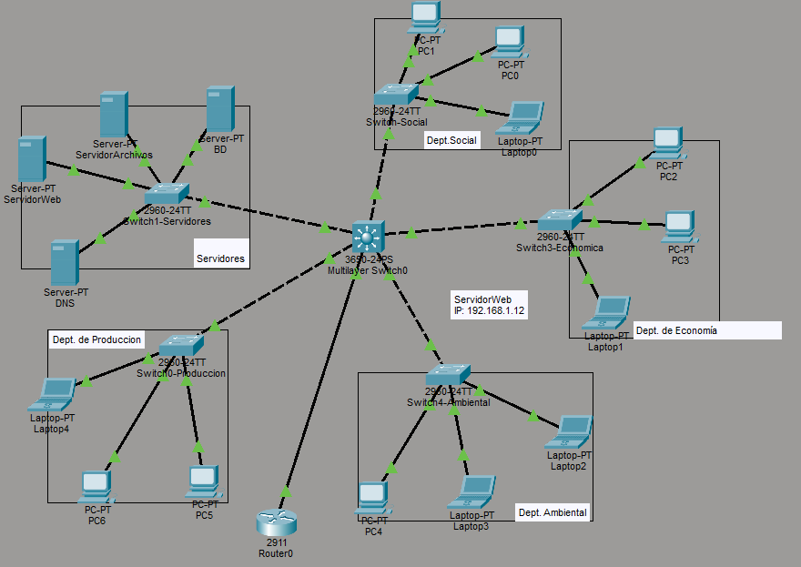

## [2026-05-12] - Fase 1: Virtualización y Aprovisionamiento Base
**Estado:** Entorno de servidor base desplegado y listo para administración remota.

### Actividades Realizadas:
- Selección y descarga de la imagen oficial de **Ubuntu Server 24.04 LTS (Noble Numbat)** para garantizar estabilidad a largo plazo.
- Creación y aprovisionamiento de la Máquina Virtual en el hipervisor con los recursos lógicos calculados: **2 Cores de CPU y 4 GB de Memoria RAM**.
- **Inyección de Almacenamiento Adicional (Requerimiento Clave):** Adición de dos (2) discos duros virtuales adicionales de **20 GB cada uno**, completamente vacíos, conectados a la controladora virtual antes del primer arranque de la máquina.
- Instalación limpia del sistema operativo en el disco primario asignado de 25 GB utilizando el sistema de archivos `ext4`.
- Configuración inicial de red asignando la interfaz en modo puente (Bridge) para integrarla al segmento correspondiente de la **VLAN de Servidores**.
- Activación, inicialización y prueba del demonio **OpenSSH Server** para la gestión remota segura del servidor en modo *headless*.

### Decisiones Técnicas:
- **Aislamiento de Discos:** Se configuró el sistema operativo en un disco independiente (disco principal), dejando los dos discos de 20 GB intactos y sin particionar durante el instalador, asegurando que la posterior configuración geométrica de **RAID 1 + LVM** se ejecute de forma limpia a nivel de bloques nativos.
- **Instalación Optimizada:** Se optó por la instalación básica/minimizada de Ubuntu Server para reducir la superficie de ataque, maximizar el rendimiento de la RAM y evitar la sobrecarga de paquetería innecesaria.

### Próximos Pasos:
1. Validar el mapeo de los nuevos dispositivos de bloques (`/dev/sdb` y `/dev/sdc`) mediante comandos de almacenamiento en Linux.
2. Construir el arreglo en espejo **RAID 1** utilizando la utilidad `mdadm`.
3. Implementar el esquema elástico de **LVM** (Volumen Físico, Grupo de Volúmenes y Volúmenes Lógicos) sobre el arreglo RAID para alojar de forma segura los datos de los futuros servicios.
4. Instalar Docker y Docker Compose para iniciar la fase de despliegue de microservicios (Web, DB, Samba).

### Evidencias:
- **Creación de VM**  
  Se define la máquina virtual Servidor-Nutresa-Prod con Ubuntu 64‑bit, 2 GB de RAM, 2 procesadores y disco de 20 GB.
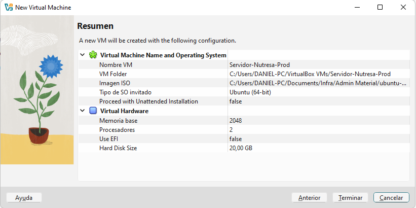
- **Configuración de red**  
  Se habilita el adaptador de red en modo NAT, con opciones de USB y carpetas compartidas visibles.
  
- **Almacenamiento** 
  Se configuran controladores IDE y SATA, con tres discos virtuales (uno principal y dos adicionales para RAID).
  
- **Instalación SSH**  
  Se habilita el servidor OpenSSH y autenticación por contraseña, preparando acceso remoto seguro.
  
- **Pantalla de login**  
  El servidor arranca en Ubuntu 26.04 LTS y muestra el prompt de login.
  
- **Sesión iniciada**  
  Ingreso exitoso con usuario nutresa, mostrando estado del sistema: carga, uso de disco, memoria, procesos y direcciones IP.
  
---------------------------------------
# Bitácora de Proyecto: Infraestructura TI - Nutresa

## [2026-05-14] - Fase 2: Almacenamiento Redundante (RAID 1 + LVM)
**Estado:** Almacenamiento redundante configurado y montado. Listo para despliegue de servicios Docker.

### Actividades Realizadas:
- Configuración de reenvío de puertos en VirtualBox (NAT: host `2222` → guest `22`) para habilitar acceso SSH remoto desde Windows.
- Instalación de cliente OpenSSH en Windows 11 Home mediante `Add-WindowsCapability`.
- Conexión SSH exitosa desde Windows PowerShell al servidor Ubuntu usando `C:\Windows\System32\OpenSSH\ssh.exe`.
- Instalación de `mdadm` para gestión de arreglos RAID por software.
- Creación del arreglo **RAID 1** (`/dev/md0`) usando los discos `/dev/sdb` y `/dev/sdc` (10 GB c/u).
- Verificación de sincronización completa del arreglo (`[UU]`, `bitmap: 0/1 pages`).
- Configuración de **LVM** sobre `/dev/md0`: Physical Volume, Volume Group `vg-nutresa` y Logical Volume `lv-docker` (8 GB).
- Formateo del volumen lógico con sistema de archivos `ext4`.
- Montaje del volumen en `/mnt/docker-data`.
- Persistencia del montaje en `/etc/fstab` y registro del arreglo RAID en `/etc/mdadm/mdadm.conf`.
- Regeneración del `initramfs` para garantizar disponibilidad del arreglo en el arranque.
- Toma de snapshot `fase2-raid-lvm-configurado` en VirtualBox.

### Decisiones Técnicas:
- **RAID 1 por software (`mdadm`):** Se eligió RAID 1 en espejo sobre los dos discos adicionales para garantizar redundancia de datos de servicios, sin depender de controladora hardware. Ante fallo de un disco, el sistema continúa operando sin pérdida de datos.
- **LVM sobre RAID:** Se superpuso LVM sobre `/dev/md0` para obtener flexibilidad en la gestión del almacenamiento (redimensionamiento, snapshots de volumen) además de la redundancia que provee el RAID.
- **Volumen dedicado para Docker:** El volumen lógico `lv-docker` (8 GB de los 10 GB disponibles) se destinó exclusivamente a `/mnt/docker-data`, aislando los datos de los servicios del disco del sistema operativo.
- **Persistencia garantizada:** La entrada en `/etc/fstab` y el registro en `mdadm.conf` con regeneración de `initramfs` aseguran que el arreglo y el montaje sobrevivan reinicios del servidor.

### Resumen de la Pila de Almacenamiento:
```
/dev/sdb (10GB) ──┐
                   ├── /dev/md0 (RAID 1) ── vg-nutresa ── lv-docker (8GB) ── /mnt/docker-data
/dev/sdc (10GB) ──┘
```

### Próximos Pasos:
1. Instalar **Docker Engine** y **Docker Compose** en el servidor.
2. Configurar Docker para usar `/mnt/docker-data` como directorio de datos (`data-root`).
3. Desplegar servicios: servidor web, base de datos y Samba sobre la infraestructura redundante.

### Evidencias:
- **Discos disponibles para RAID**
  Salida de `lsblk` mostrando `sdb` y `sdc` (10 GB c/u) sin particiones, listos para el arreglo.
  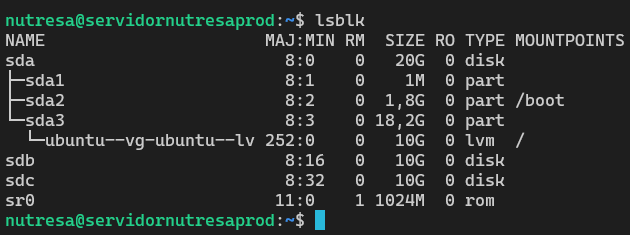

- **Creación del arreglo RAID 1**
  Ejecución de `mdadm --create /dev/md0 --level=1 --raid-devices=2 /dev/sdb /dev/sdc` con confirmación exitosa.
  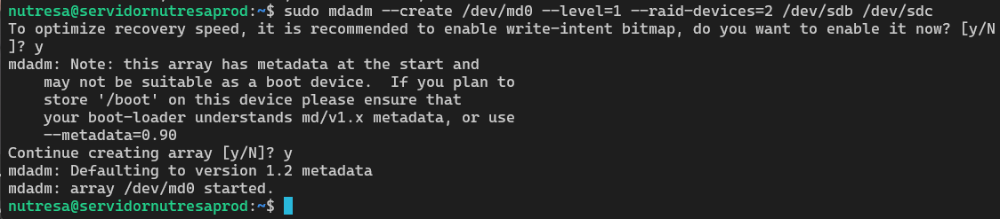

- **Sincronización completa del RAID**
  Salida de `cat /proc/mdstat` mostrando `[UU]` y bitmap limpio, confirmando espejo activo.
  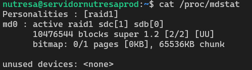

- **Configuración LVM**
  Comandos `pvcreate`, `vgcreate` y `lvcreate` ejecutados exitosamente sobre `/dev/md0`.
  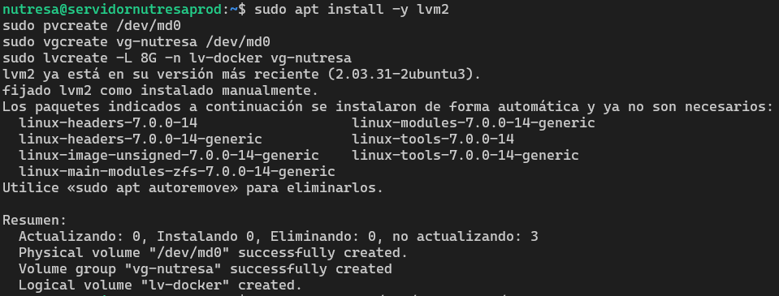

- **Volumen montado**
  Salida de `df -h /mnt/docker-data` y `lsblk` mostrando `lv-docker` (7.4 GB disponibles) montado correctamente.
  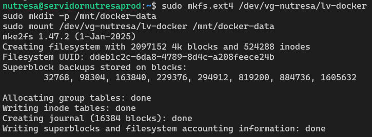
  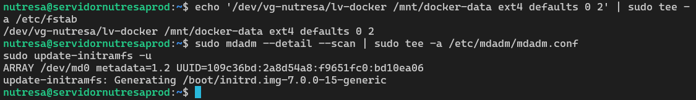
- **Muestra de comprobante**
  salida pon consola de comando de `df -h /mnt/docker-data lsblk`
  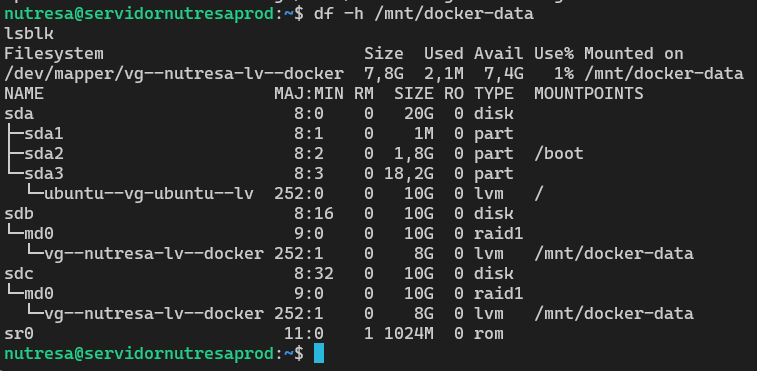
- **Snapshot fase2**
  VirtualBox mostrando snapshot `fase2-raid-lvm-configurado` creado sobre la cadena de instantáneas.
  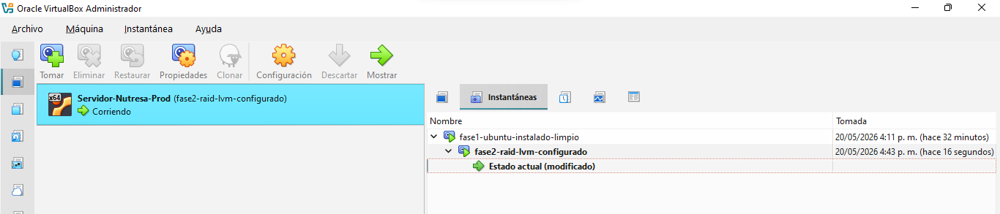

---------------------------------------

## [2026-05-16] - Fase 3: Contenedores y Servicios
**Estado:** Servicios Docker desplegados y operativos. Login funcional contra base de datos PostgreSQL.

### Actividades Realizadas:
- Cambio de adaptador de red de NAT a **Bridged (Adaptador Puente)** para acceso directo desde la red local (IP asignada: `192.168.1.12`).
- Instalación de **Docker Engine** y **Docker Compose Plugin** desde el repositorio oficial de Docker para Ubuntu 26.04.
- Adición del usuario `nutresa` al grupo `docker` para ejecución sin privilegios elevados.
- Creación de la estructura de directorios de persistencia en `/datos`:
  ```
  /datos/
  ├── nginx/
  │   ├── html/        ← contenido web estático
  │   └── conf/        ← configuración personalizada de Nginx
  ├── postgres/
  │   └── data/        ← volumen persistente de PostgreSQL
  ├── samba/
  │   └── share/       ← carpeta compartida en red
  └── backend/         ← código fuente del servicio API Node.js
  ```
- Despliegue de **Nginx** como servidor web vía Docker Compose, con volúmenes enlazados a `/datos/nginx`.
- Despliegue de **PostgreSQL 16** como motor de base de datos vía Docker Compose, con persistencia en `/datos/postgres/data`.
- Creación de base de datos `nutresadb` con usuario `nutresa` y tablas:
  - `usuarios` (id, username, password, rol, creado_en)
  - `logs_acceso` (id, usuario_id, fecha, accion)
- Inserción de datos de prueba: 3 usuarios (`admin`, `juan.perez`, `maria.lopez`) y registros de acceso.
- Desarrollo e integración de un **backend Node.js/Express** (`/login` endpoint) que autentica contra PostgreSQL y registra accesos en `logs_acceso`.
- Creación de página HTML de login (`index.html`) servida por Nginx, con formulario funcional que consume el backend en el puerto `3000`.
- Instalación y configuración de **Samba** para compartir `/datos/samba/share` en red local.
- Creación de usuario Samba con contraseña `Nutresa2026`.
- Verificación de persistencia tras reinicio: los 3 contenedores (`nutresa-web`, `nutresa-db`, `nutresa-backend`) y el servicio `smbd` arrancan automáticamente.
- Toma de snapshot `fase3-docker-servicios-configurados` en VirtualBox.

### Decisiones Técnicas:
- **Separación de servicios en contenedores:** Cada servicio (Nginx, PostgreSQL, Node.js) corre en su propio contenedor con `restart: always`, garantizando recuperación automática ante fallos.
- **Volúmenes en `/datos` (LVM sobre RAID):** Toda la persistencia de los contenedores se almacena sobre el volumen lógico `lv-docker`, heredando la redundancia del RAID 1 configurado en Fase 2.
- **Backend propio vs. solución preconstruida:** Se optó por desarrollar un servicio Express mínimo para demostrar la integración completa Web → API → BD, evitando cajas negras en la sustentación.
- **Samba nativo (no contenedor):** Se instaló Samba directamente en el host para mayor simplicidad de configuración y acceso directo al sistema de archivos del servidor.
- **Adaptador Puente:** El cambio de NAT a Bridged permite acceso desde cualquier equipo de la red local, indispensable para la demo de la sustentación.

### Resumen de la Pila de Servicios:

```
Cliente (Browser)
      │ HTTP :80
      ▼
[nutresa-web — Nginx]  ←── /datos/nginx/html/index.html
      │ fetch POST :3000/login
      ▼
[nutresa-backend — Node.js/Express]
      │ pg query
      ▼
[nutresa-db — PostgreSQL 16]  ←── /datos/postgres/data
      │ tablas: usuarios, logs_acceso

[smbd — Samba]  ←── /datos/samba/share  (compartido en red)
```

### Credenciales de Prueba:

| Usuario      | Contraseña  | Rol   |
|--------------|-------------|-------|
| admin        | admin2026   | admin |
| juan.perez   | pass123     | user  |
| maria.lopez  | pass456     | user  |

### Próximos Pasos:
1. Configurar **NTP** (`chrony`) para sincronización de tiempo.
2. Activar y configurar **firewall** (`ufw`) con reglas por servicio.
3. Implementar **scripts Bash** de backup, monitoreo y despliegue.
4. Configurar **usuarios y permisos** (SETUID, SETGID, sticky bit) en `/datos`.
5. Revisar logs con `journalctl`, `htop` y herramientas de monitoreo.

### Evidencias:
- **Docker instalado**
  Salida de `docker run --rm hello-world` confirmando instalación correcta del motor Docker.
  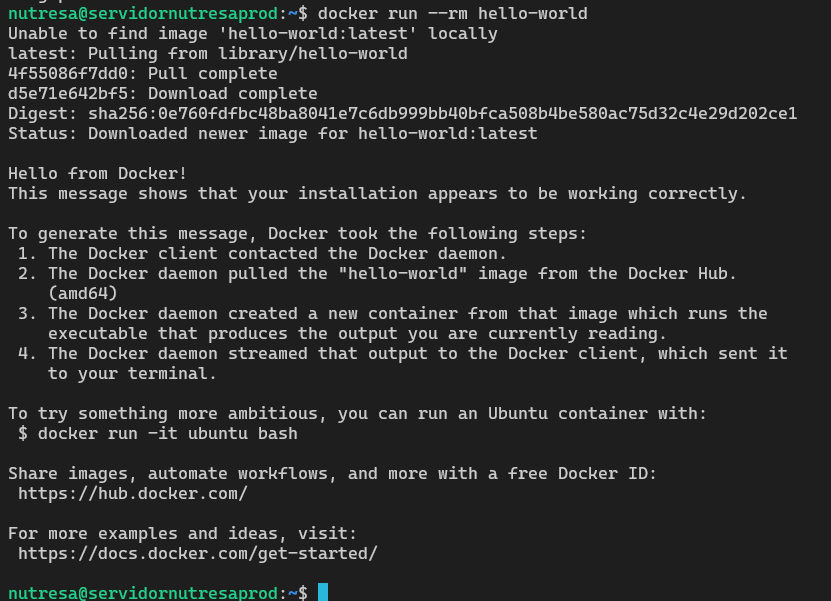

- **Estructura de directorios**
  Salida de `ls -la /datos/` mostrando carpetas `nginx`, `postgres` y `samba` con propietario `nutresa`.
  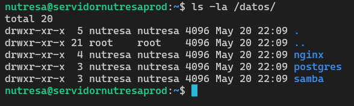

- **Contenedores corriendo**
  Salida de `docker ps` mostrando `nutresa-web`, `nutresa-db` y `nutresa-backend` en estado `Up`.
  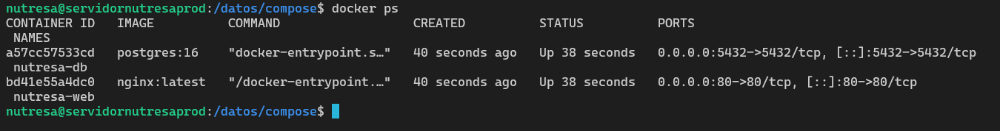

- **Base de datos funcional**
  Salida de `SELECT * FROM usuarios;` en psql mostrando los 3 usuarios insertados.
  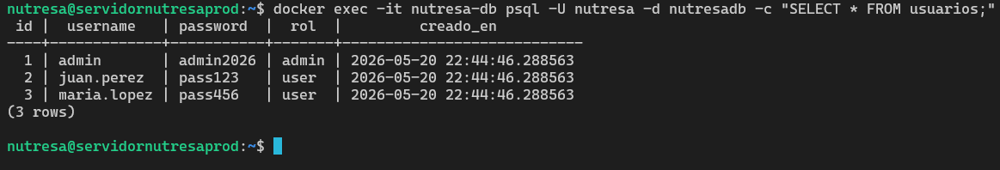

- **Login funcional desde browser**
  Página `http://192.168.1.12` mostrando formulario de login con respuesta exitosa del backend.
  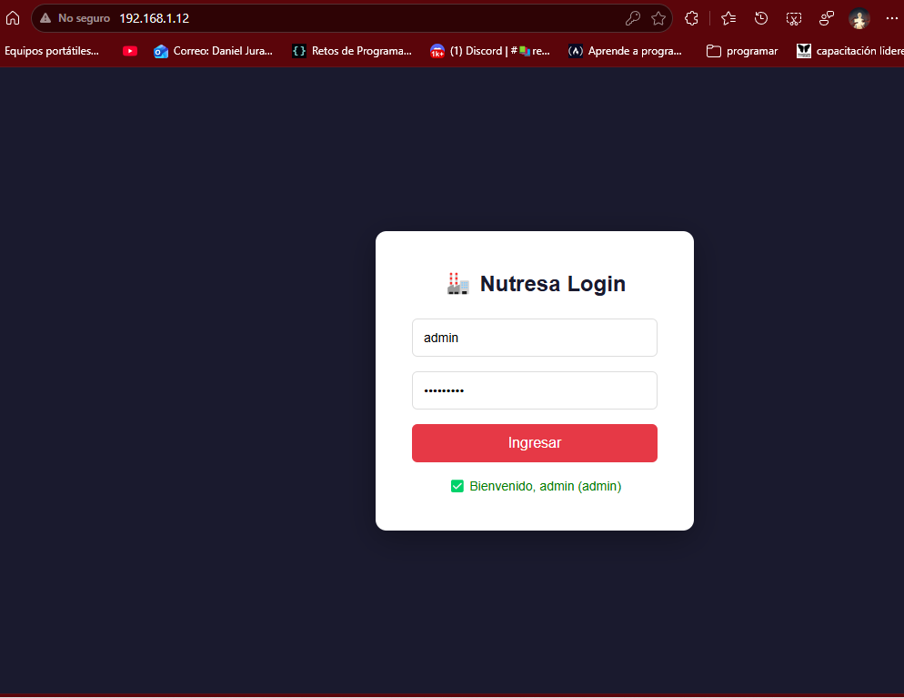

- **Samba activo**
  Salida de `systemctl status smbd` mostrando `active (running)` con estado `ready to serve connections`.
  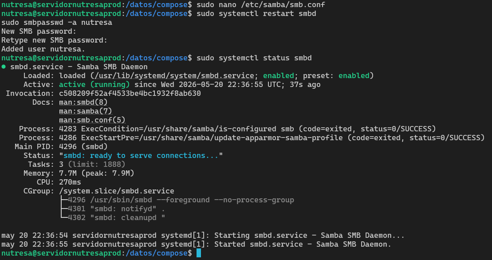

- **Persistencia tras reinicio**
  Salida de `docker ps` y `systemctl status smbd` después de `sudo reboot`, confirmando arranque automático de todos los servicios.
  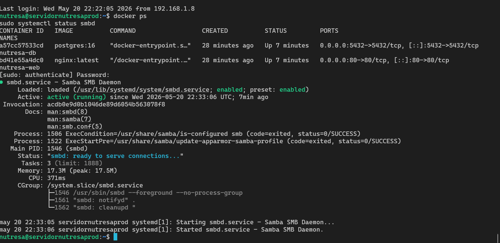

- **Snapshot fase3**
  VirtualBox mostrando snapshot `fase3-docker-servicios-configurados` en la cadena de instantáneas.
  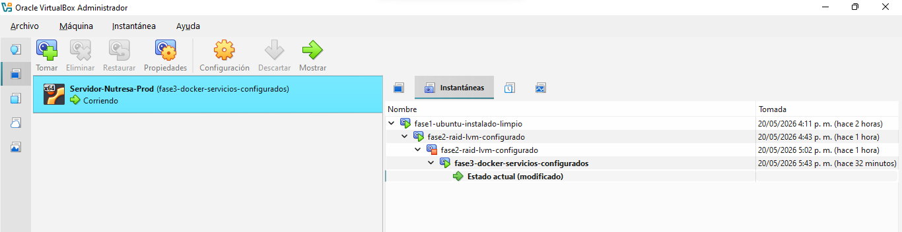
---------------------------------------------------
## [2026-05-18] - Fase 4: Seguridad, Automatización y Monitoreo
**Estado:** Firewall configurado, scripts Bash operativos, monitoreo validado.

### Actividades Realizadas:
- Instalación y configuración de **chrony** para sincronización NTP con servidor `ntp-nts-2.ps5.canonical.com` (Stratum 3, offset ~18ms).
- Activación y configuración de **ufw** (firewall) con reglas por servicio:
  - Puerto 22 → SSH
  - Puerto 80 → Nginx (Web)
  - Puerto 3000 → Backend Node.js
  - Puerto 5432 → PostgreSQL
  - Puerto 445 → Samba
- Aplicación de permisos especiales en `/datos`:
  - **Sticky bit** (`1777`) en `/datos/samba/share` → evita que usuarios eliminen archivos ajenos.
  - **SETGID** (`g+s`) en `/datos/nginx/html` → archivos heredan grupo del directorio.
  - **SETGID** (`g+s`) en `/datos/postgres/data` → consistencia de grupo en datos de BD.
  - **SETUID** (`u+s`) en `/datos/scripts/backup.sh` → script ejecuta con privilegios del propietario.
- Creación de tres scripts Bash en `/datos/scripts/`:
  - `backup.sh` → dump PostgreSQL + tar de Samba y Nginx + limpieza de backups >7 días.
  - `monitoreo.sh` → CPU/RAM, disco, RAID, estado contenedores, Samba y últimos accesos DB.
  - `deploy.sh` → down, pull, up --build de todos los contenedores Docker.
- Ejecución y verificación de los tres scripts sin errores.
- Revisión de logs con `journalctl -u docker` y monitoreo en tiempo real con `htop`.

### Decisiones Técnicas:
- **ufw sobre iptables directo:** ufw es la herramienta recomendada en Ubuntu y cumple el requisito explícito del enunciado. Internamente gestiona iptables, sin necesidad de configuración manual de cadenas.
- **Sticky bit en Samba:** Al ser una carpeta compartida multiusuario, el sticky bit previene borrados accidentales o maliciosos de archivos de otros usuarios.
- **SETGID en directorios de servicios:** Garantiza que archivos creados por Docker dentro de `html` y `data` hereden el grupo `nutresa`, facilitando la administración sin sudo.
- **Backups con retención de 7 días:** `find -mtime +7 -delete` automatiza la limpieza, evitando saturación del volumen lógico `lv-docker`.
- **Monitoreo integrado en script:** Consolida en una sola ejecución los indicadores clave del sistema, incluyendo auditoría de accesos desde la base de datos.

### Resumen de Permisos Aplicados:
```
/datos/samba/share    drwxrwxrwt  (sticky bit)
/datos/nginx/html     drwxr-sr-x  (SETGID)
/datos/postgres/data  drwxr-sr-x  (SETGID)
/datos/scripts/backup.sh  -rwsrwxr-x  (SETUID)
```

### Resumen de Reglas Firewall (ufw):
```
Puerto  Protocolo  Acción   Servicio
22      TCP        ALLOW    SSH
80      TCP        ALLOW    Nginx Web
3000    TCP        ALLOW    Backend API
5432    TCP        ALLOW    PostgreSQL
445     TCP        ALLOW    Samba
```

### Estado General del Proyecto:
- [x] Diseño de red (VLANs + Packet Tracer)
- [x] Virtualización (Ubuntu Server 26.04 en VirtualBox)
- [x] RAID 1 + LVM
- [x] Docker + Docker Compose
- [x] Nginx + Backend Node.js + PostgreSQL
- [x] Samba
- [x] NTP (chrony)
- [x] Firewall (ufw)
- [x] Permisos especiales (SETUID, SETGID, sticky bit)
- [x] Scripts Bash (backup, monitoreo, despliegue)
- [x] Monitoreo (htop, journalctl)
- [ ] Alta disponibilidad (documentación)

### Próximos Pasos:
1. Documentar estrategia de alta disponibilidad y recuperación ante fallos.
2. Toma de snapshot `fase4-seguridad-scripts-monitoreo`.
3. Commit final al repositorio Git.
4. Preparar video demo y sustentación.

### Evidencias:
- **NTP sincronizado**
  Salida de `chronyc tracking` mostrando Reference ID, Stratum 3 y offset mínimo.
  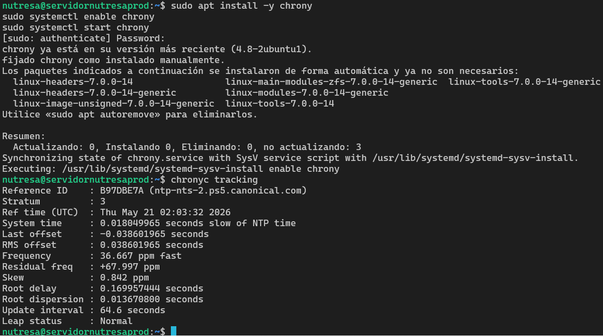

- **Firewall activo**
  Salida de `sudo ufw status` mostrando puertos 22, 80, 3000, 5432 y 445 en ALLOW.
  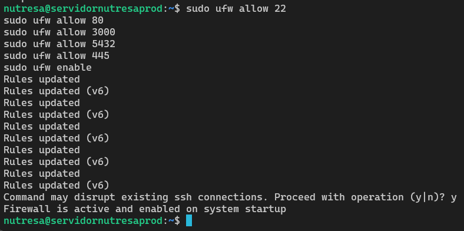
  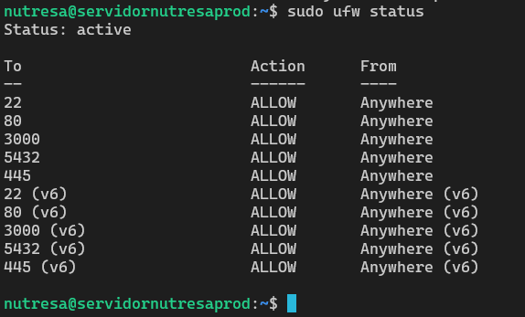

- **Permisos especiales**
  Salida de `ls -la /datos/samba/` y `ls -la /datos/nginx/` mostrando sticky bit y SETGID.
  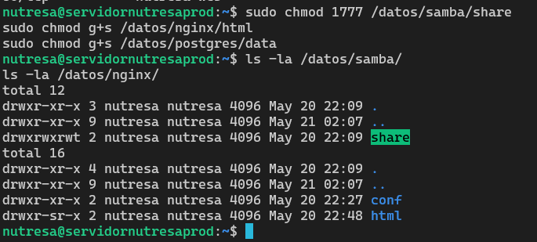

- **Scripts Bash**
  Salida de `ls -la /datos/scripts/` mostrando los 3 scripts con permisos de ejecución.
  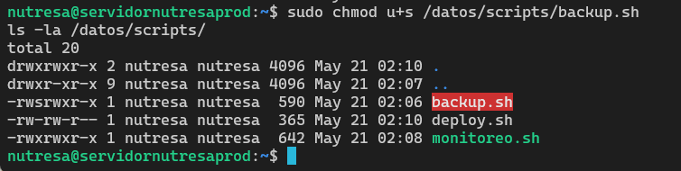

- **Backup ejecutado**
  Salida de `bash backup.sh` confirmando dump de BD, compresión de archivos y limpieza.
  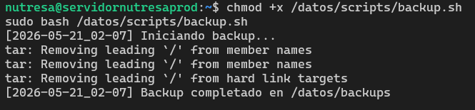

- **Monitoreo ejecutado**
  Salida completa de `bash monitoreo.sh` con CPU, RAM, RAID [UU], contenedores UP y logs DB.
  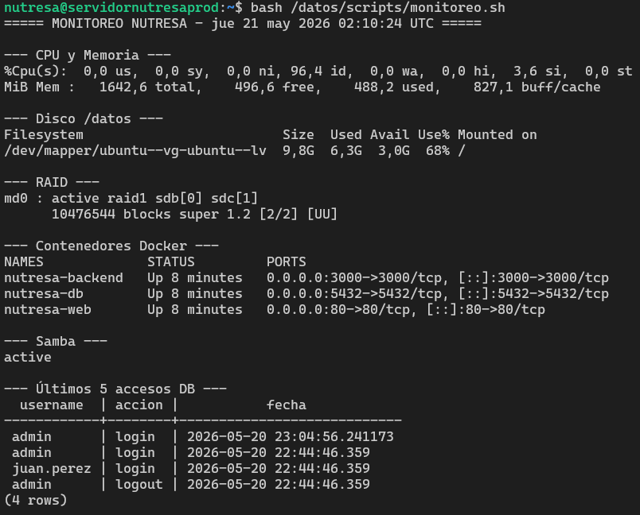

- **htop**
  Vista de htop mostrando procesos activos: mdadm, chronyd, sshd, Docker y sistema estable.
  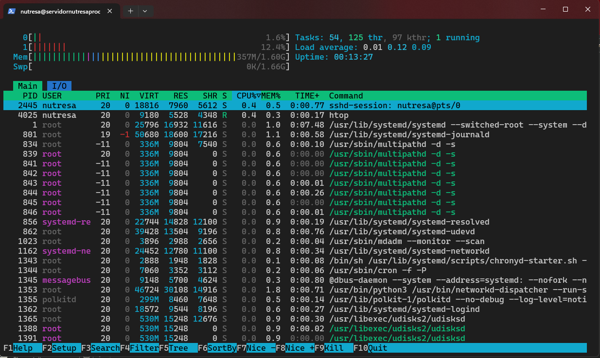

- **journalctl Docker**
  Logs de Docker mostrando inicio de contenedores y actividad reciente sin errores críticos.
  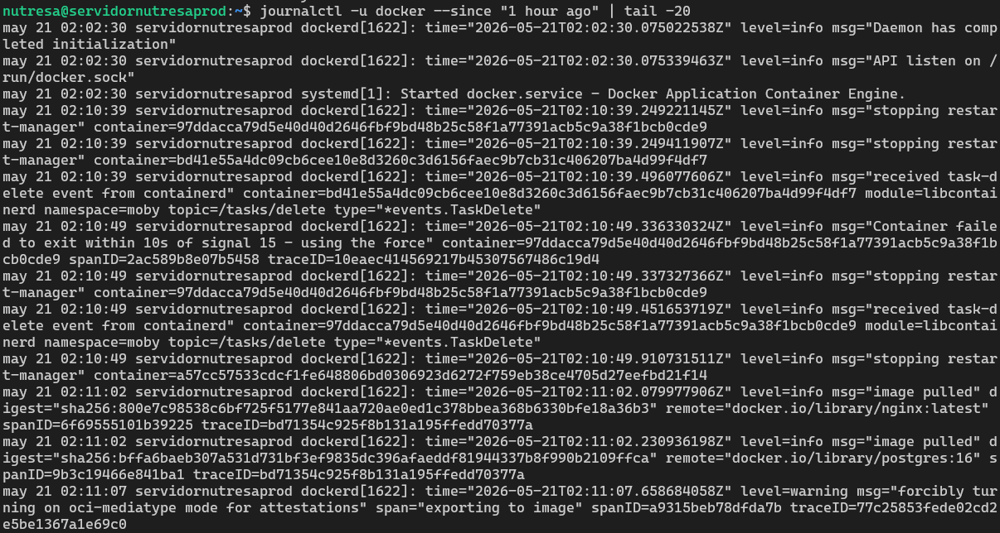